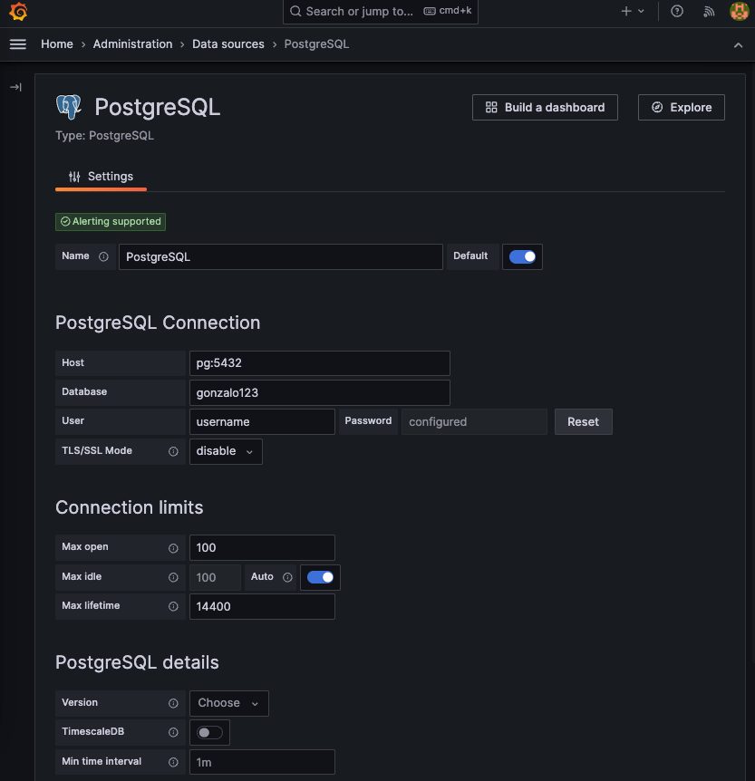

## Connecting Grafana to PostgreSQL with Python for Time Series Analysis

In the world of data analysis and graphs, we have three important tools: Grafana, PostgreSQL, and Python. They work together to help us look at data and track how it changes over time. In this article, we'll learn step by step how to use Grafana with a PostgreSQL database. We'll also discover how to use Python to record data that changes over time. By the end of this article, you'll know how to set up these tools, and you'll see how they can be useful for your work with data.

First we create our table. We also create a sequence for the primary key


```sql
CREATE TABLE MEASUREMENTLOG
(
    id              numeric(10)            NOT NULL,
    key             character varying(100) NOT NULL,
    datetime        TIMESTAMP WITHOUT TIME ZONE NOT NULL,
    status          numeric(2) NOT NULL,

    CONSTRAINT MEASUREMENTLOG_pkey PRIMARY KEY (id)
);

create sequence SEQ_MEASUREMENTLOG
    minvalue 0
    maxvalue 999999999999999999
    start with 1
    increment by 1
    cache 1;
```

And a simple python script to persists a timeserie.

```python
from random import randint
from time import sleep
from datetime import datetime
import os
import logging
import pytz

from dbutils import transactional, get_conn

from settings import DSN

tz = pytz.timezone('Europe/Madrid')

logging.basicConfig(
    format='%(asctime)s [%(levelname)s] %(message)s',
    level='INFO',
    datefmt='%d/%m/%Y %X')

logger = logging.getLogger(__name__)


def persists(key, dt, status):
    with transactional(conn=get_conn(DSN)) as db:
        seq_log = db.fetch_all("SELECT nextval('seq_measurementlog')")[0][0]
        db.insert('measurementlog', dict(
            id=seq_log,
            key=key,
            datetime=dt,
            status=status
        ))


KEY = os.getenv('KEY')
status = 0
while True:
    now = datetime.now(tz)
    persists(
        key=KEY,
        dt=now,
        status=status
    )
    logger.info(f"[{now}] status: {status}")
    status = 1 if status == 0 else 0
    sleep(randint(5, 15))
```

Now we set up PostgreSQL database and Grafana in a docker-compose.yml. 

More information about the configuration of postgresql and grafana here:
https://grafana.com/docs/grafana/latest/datasources/postgres/
https://github.com/grafana/grafana/blob/main/conf/sample.ini

```yaml
version: '3'

services:
  pg:
    image: pg
    restart: unless-stopped
    build:
      context: .docker/pg/
      dockerfile: Dockerfile
    environment:
      POSTGRES_PASSWORD: ${POSTGRES_PASSWORD}
      POSTGRES_USER: ${POSTGRES_USER}
      POSTGRES_DB: ${POSTGRES_DB}
      PGTZ: ${POSTGRES_TIMEZONE}
      PGDATA: /var/lib/postgresql/data/pgdata
    ports:
      - "5432:5432"
  grafana:
    image: grafana
    restart: unless-stopped
    build:
      context: .docker/grafana/
      dockerfile: Dockerfile
    environment:
      - GF_TIMEZONE=Europe/Madrid
      - GF_SECURITY_ADMIN_USER=${GF_SECURITY_ADMIN_USER}
      - GF_SECURITY_ADMIN_PASSWORD=${GF_SECURITY_ADMIN_PASSWORD}
      - GF_USERS_DEFAULT_THEME=${GF_USERS_DEFAULT_THEME}
      - GF_USERS_ALLOW_SIGN_UP=${GF_USERS_ALLOW_SIGN_UP}
      - GF_USERS_ALLOW_ORG_CREATE=${GF_USERS_ALLOW_ORG_CREATE}
      - GF_AUTH_ANONYMOUS_ENABLED=${GF_AUTH_ANONYMOUS_ENABLED}
    ports:
      - "3000:3000"
    depends_on:
      - pg
```

We run the stack, Connect the grafana at port 3000 and configure the datasource



After that we can create the dashboard


We are using this query

```sql
SELECT 
    datetime, 
    status 
FROM 
    measurementlog 
WHERE 
    key = 'id1' and 
    $__timeFilter(datetime)
```

And that's the dashboard


